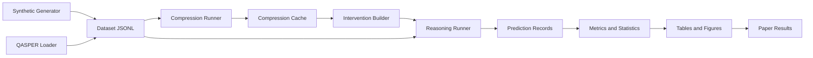

# ISM 실험 시스템 구현 및 검증 계획

## 1. 문서 목적

이 문서는 [deep-research-report.md](./deep-research-report.md)의 연구 설계를 실제 코드와 Colab 실험으로 구현하기 위한 실행 계획이다. 목표는 다음 세 가지다.

1. 실험 조건을 코드 수준에서 재현 가능하게 만든다.
2. 작은 smoke test부터 전체 실험까지 단계적으로 확장한다.
3. 결과가 가설에 맞는지와 별개로 데이터, 프롬프트, 출력, 통계가 감사 가능한 형태로 남도록 한다.

본 계획은 **로컬 저장소를 source of truth**로 사용하고, Google Colab은 GPU 실행 환경으로만 사용한다. Colab에서 작성한 핵심 코드는 노트북에만 남기지 않고 로컬 Python 모듈로 반영한다.

## 2. 시스템 원칙

### 2.1 연구 원칙

- 동일 문서-질문 쌍으로 모든 방법을 비교한다.
- 압축 결과는 문서당 한 번 생성하고 캐시한다.
- 토큰 예산은 동일 tokenizer로 측정한다.
- 실험 조건마다 prompt, model revision, seed, decoding 설정을 기록한다.
- test split은 구현과 프롬프트 조정에 사용하지 않는다.
- 결과가 기대와 다르더라도 원시 출력과 실패 사례를 보존한다.

### 2.2 구현 원칙

- 노트북은 실행과 관찰을 담당하고, 핵심 로직은 `src/`에 둔다.
- 모든 중간 산출물은 JSONL 또는 Parquet처럼 구조화된 형식으로 저장한다.
- 같은 입력과 설정에서 같은 캐시 키가 생성되어야 한다.
- 한 실험의 일부가 실패해도 완료된 샘플을 잃지 않도록 append-safe하게 기록한다.
- 외부 모델 호출과 순수 데이터 변환 로직을 분리한다.
- 먼저 작은 deterministic test를 통과시킨 뒤 GPU 실험을 수행한다.

## 3. 전체 시스템 구성



시스템은 다음 여섯 계층으로 나눈다.

| 계층 | 책임 |
|---|---|
| Data | Synthetic Rule-QA 생성, QASPER 로드, split 관리 |
| Representation | ISM 파싱, 직렬화, token budget 검증 |
| Intervention | removal, corruption, random, swap 생성 |
| Inference | 압축기와 추론기 실행, batch, retry, cache |
| Evaluation | accuracy, AR, CR, ES, SR, paired statistics |
| Reporting | 표, 그림, 실패 사례, 논문 입력 파일 생성 |

## 4. 권장 저장소 구조

```text
SESC/
├── deep-research-report.md
├── ism-system-plan.md
├── README.md
├── pyproject.toml
├── configs/
│   ├── models/
│   │   ├── qwen_7b_4bit.yaml
│   │   └── qwen_1_5b.yaml
│   ├── experiments/
│   │   ├── smoke.yaml
│   │   ├── ablation.yaml
│   │   ├── fixed_budget.yaml
│   │   ├── reuse.yaml
│   │   ├── swap.yaml
│   │   └── qasper.yaml
│   └── prompts/
│       ├── ism_compress.txt
│       ├── summary_compress.txt
│       └── reasoner.txt
├── src/ism/
│   ├── __init__.py
│   ├── schemas.py
│   ├── token_budget.py
│   ├── cache.py
│   ├── data/
│   │   ├── synthetic.py
│   │   ├── rule_graph.py
│   │   ├── render.py
│   │   └── qasper.py
│   ├── compression/
│   │   ├── base.py
│   │   ├── ism.py
│   │   ├── summary.py
│   │   ├── keyword.py
│   │   └── llmlingua.py
│   ├── interventions/
│   │   ├── remove.py
│   │   ├── corrupt.py
│   │   ├── randomize.py
│   │   └── swap.py
│   ├── inference/
│   │   ├── model.py
│   │   ├── compress_runner.py
│   │   └── reason_runner.py
│   ├── evaluation/
│   │   ├── answers.py
│   │   ├── metrics.py
│   │   ├── statistics.py
│   │   └── errors.py
│   └── reporting/
│       ├── tables.py
│       └── figures.py
├── scripts/
│   ├── generate_synthetic.py
│   ├── run_compression.py
│   ├── run_reasoning.py
│   ├── run_experiment.py
│   ├── evaluate.py
│   └── export_results.py
├── notebooks/
│   ├── 00_colab_environment.ipynb
│   ├── 01_smoke_test.ipynb
│   ├── 02_ablation.ipynb
│   ├── 03_fixed_budget.ipynb
│   ├── 04_reuse.ipynb
│   ├── 05_swap_lora.ipynb
│   └── 06_qasper.ipynb
├── tests/
│   ├── unit/
│   ├── integration/
│   └── fixtures/
├── data/
│   ├── raw/
│   ├── processed/
│   └── samples/
├── artifacts/
│   ├── compressions/
│   ├── predictions/
│   ├── metrics/
│   ├── figures/
│   └── logs/
└── results/
    ├── manifests/
    ├── tables/
    └── reports/
```

대용량 `data/`, `artifacts/`, model weight는 Git에 커밋하지 않는다. 대신 manifest, 소형 fixture, 설정, 통계 결과와 최종 표는 커밋한다.

## 5. 데이터 계약

### 5.1 Synthetic 문서

```json
{
  "document_id": "syn_test_000001",
  "split": "test",
  "document_text": "...",
  "document_tokens": 1248,
  "facts": [],
  "rules": [],
  "gold_graph": {},
  "generator_version": "0.1.0",
  "seed": 42
}
```

### 5.2 질문 레코드

```json
{
  "question_id": "syn_test_000001_q03",
  "document_id": "syn_test_000001",
  "question": "Is the case high risk?",
  "answer": "HIGH",
  "answer_type": "classification",
  "required_rule_ids": ["r2", "r5", "r8"],
  "ood_type": null
}
```

### 5.3 ISM 압축 레코드

```json
{
  "compression_id": "sha256:...",
  "document_id": "syn_test_000001",
  "method": "ism",
  "budget": 128,
  "model": "Qwen/Qwen2.5-7B-Instruct",
  "model_revision": "...",
  "prompt_version": "ism-v1",
  "symbols": [
    {"label": "Z1", "definition": "marker_a high & marker_b low -> risk+"}
  ],
  "relations": "Z1 Z3 !Z4 => HIGH",
  "serialized_text": "...",
  "token_count": 117,
  "generation_attempts": 1,
  "valid": true,
  "validation_errors": []
}
```

### 5.4 예측 레코드

```json
{
  "run_id": "ablation-seed42",
  "question_id": "syn_test_000001_q03",
  "compression_id": "sha256:...",
  "condition": "symbol_only",
  "prediction_raw": "HIGH",
  "prediction_normalized": "HIGH",
  "correct": true,
  "input_tokens": 164,
  "output_tokens": 1,
  "latency_ms": 824,
  "seed": 42,
  "error": null
}
```

### 5.5 실험 manifest

모든 실행은 다음 정보를 담은 manifest를 생성한다.

```yaml
run_id: ablation-qwen7b-b128-s42
git_commit: null
dataset_version: synthetic-v1
split: dev
conditions:
  - full_context
  - full_symbol_dict
  - symbol_only
  - corrupted_dict
  - random_symbol
budget: 128
seed: 42
started_at: null
completed_at: null
status: planned
```

## 6. 핵심 모듈 설계

### 6.1 Rule graph와 synthetic generator

`rule_graph.py`는 자연어와 독립적인 정규화된 논리 구조를 담당한다.

필수 규칙 타입:

- conjunction
- disjunction
- exception
- exception-to-exception
- precedence
- threshold
- temporal ordering

생성 순서:

1. entity, attribute, value vocabulary를 seed로 표본화한다.
2. 규칙 그래프를 생성한다.
3. 충돌과 순환을 검사한다.
4. 사례 facts를 생성한다.
5. symbolic executor로 gold answer를 계산한다.
6. 문서와 질문을 자연어로 렌더링한다.
7. 재실행 결과가 gold answer와 일치하는지 확인한다.

초기 구현에서는 자유 생성 LLM을 사용하지 않고 template renderer로 시작한다. 그래프와 실행기가 안정된 이후 paraphrase renderer를 추가한다.

### 6.2 ISM parser

모델 출력은 가능한 한 구조화된 텍스트 형식으로 제한한다.

```text
[DICTIONARY]
Z1 := ...
Z2 := ...

[RELATIONS]
...
```

파서는 다음을 검증한다.

- 라벨 중복 없음
- 정의가 비어 있지 않음
- relations에서 정의되지 않은 라벨 사용 금지
- 전체 tokenizer 길이가 budget 이하
- 최종 답을 직접 기록하는 leakage 패턴 없음
- 허용되지 않은 섹션 없음

파싱 실패 시 원문 출력을 보존하고 제한 횟수만 재생성한다.

### 6.3 Intervention builder

모든 intervention은 원본 압축 레코드를 변경하지 않고 새 레코드를 생성한다.

- `remove_dictionary`: 사전만 제거하고 relations 유지
- `corrupt_dictionary`: 정의를 derangement로 치환
- `random_symbol`: 심볼 수와 토큰 길이를 맞춘 무의미 구조 생성
- `swap_labels`: label bijection을 만들고 사전과 relations에 동일 적용

재현성을 위해 치환표와 random seed를 레코드에 저장한다.

### 6.4 Model adapter

모델별 코드를 실험 로직에서 분리하기 위해 공통 인터페이스를 둔다.

```python
class TextGenerator(Protocol):
    def generate(self, requests: list[GenerationRequest]) -> list[GenerationResult]:
        ...
```

초기 backend:

- Hugging Face Transformers
- 4-bit bitsandbytes
- 단일 GPU batch inference

후속 backend:

- vLLM
- API-compatible endpoint

모든 backend는 동일한 `GenerationResult`를 반환해야 한다.

### 6.5 Cache

캐시 키:

```text
sha256(
  document_text
  + method
  + budget
  + prompt_version
  + model_id
  + model_revision
  + decoding_config
)
```

질문은 문서 독립 압축의 캐시 키에 포함하지 않는다. 질문이 캐시 키에 포함되면 ISM이 question-aware summary로 변질될 수 있다.

## 7. 로컬과 Colab의 역할 분담

### 7.1 로컬에서 수행

- 데이터 스키마와 generator 개발
- unit/integration test
- 소형 fixture 생성
- intervention 검증
- mock 및 CPU end-to-end 실행
- 로컬에서 가능한 소형 모델 generation smoke
- 호출 수, GPU 시간, 저장공간 비용 dry-run
- retry/resume/cache 검증
- 통계 코드와 표 생성
- Git 관리
- 논문 문서 업데이트

### 7.2 Colab에서 수행

- 로컬 blocking TC 통과 후 최소 GPU smoke
- 7B 4-bit 모델 설치 및 로딩
- 압축과 추론 batch 실행
- LoRA swap 학습
- QASPER 전체 평가
- GPU latency와 memory 기록

Colab에서는 새로운 도메인 로직을 디버깅하지 않는다. Colab에서 발견한 버그는 먼저 로컬 코드와 TC로 재현한 뒤 수정하고, 로컬 회귀 테스트 통과 후 다시 서버에서 확인한다.

### 7.3 Colab MCP 운영 절차

1. 브라우저에서 사용할 Colab notebook을 연다.
2. Codex에서 `open_colab_browser_connection`을 호출한다.
3. `get_cells`로 노트북 상태를 읽는다.
4. 환경 셀을 추가하거나 갱신한다.
5. 셀 단위로 실행하고 출력을 확인한다.
6. 실패한 셀만 수정한 뒤 재실행한다.
7. 결과를 Drive 또는 로컬 저장소로 내보낸다.
8. 핵심 변경은 로컬 `src/`와 config에 반영한다.

Colab MCP는 현재 열린 노트북의 셀을 조작하는 도구다. 실험의 유일한 사본을 노트북에 두지 않는다.

## 8. 코딩 검증 전략과 단계별 TC

이 절의 테스트는 논문의 가설이나 모델 성능을 검증하지 않는다. 검증 대상은 **코드의 정확성, 모듈 경계, 계약 일관성, 실패 복구, 재현성, 유지보수성**이다. 모델 정확도가 낮더라도 아래 TC가 모두 통과할 수 있어야 하며, 반대로 모델 결과가 좋아도 blocking TC가 실패하면 해당 단계는 완료로 간주하지 않는다.

### 8.1 TC 작성 규칙

모든 TC는 다음 정보를 가진다.

| 필드 | 의미 |
|---|---|
| TC ID | `P<Phase>-<Category>-<Number>` |
| 목적 | 어떤 코드 위험을 차단하는가 |
| 입력/사전조건 | fixture, config, mock 상태 |
| 실행 | 테스트가 수행하는 동작 |
| 기대 결과 | 기계적으로 판정 가능한 결과 |
| 등급 | Blocking 또는 Non-blocking |

분류 코드는 다음과 같다.

| 코드 | 분류 |
|---|---|
| `ARC` | 아키텍처와 의존성 방향 |
| `CON` | 데이터·인터페이스 계약 |
| `FUN` | 순수 기능 정확성 |
| `DET` | 결정성 및 재현성 |
| `ERR` | 오류 처리와 실패 격리 |
| `IO` | 저장, 직렬화, 원자성 |
| `CFG` | 설정 검증과 모순 탐지 |
| `INT` | 모듈 간 통합 |
| `RES` | resume, retry, idempotency |
| `ENV` | 로컬·Colab 환경 동등성 |
| `REG` | 회귀 방지 |
| `COST` | 실행량, GPU 시간, 비용 상한 |

### 8.2 공통 Definition of Done

모든 Phase는 아래 공통 조건을 만족해야 종료할 수 있다.

- 새 public API에 type annotation이 있다.
- 정적 타입 검사와 lint가 오류 없이 끝난다.
- 테스트가 네트워크와 GPU 없이 기본 실행 가능하다.
- 외부 모델이 필요한 테스트는 marker로 분리된다.
- 테스트 순서를 바꾸거나 병렬 실행해도 결과가 같다.
- 임시 디렉터리에서 실행되며 개발자 로컬 경로에 의존하지 않는다.
- 실패 시 stack trace와 관련 `run_id`, sample ID가 로그에 남는다.
- 기존 golden fixture 변경은 명시적인 승인 없이 자동 갱신하지 않는다.
- 생성물과 캐시는 Git 추적 파일을 덮어쓰지 않는다.
- 모든 blocking TC가 통과하고 skip된 blocking TC가 없다.

권장 자동 검사 명령:

```bash
ruff check .
ruff format --check .
pyright src tests
pytest -m "not gpu and not network"
```

### 8.3 SOLID 및 모듈 경계 검증

SOLID 준수 여부는 주관적 리뷰만으로 판단하지 않고 아래 구조적 TC로 확인한다.

#### Single Responsibility

- 데이터 생성기는 파일 저장이나 모델 추론을 직접 수행하지 않는다.
- parser는 모델 호출이나 retry를 수행하지 않는다.
- metric 함수는 파일을 읽거나 쓰지 않고 입력 레코드만 계산한다.
- runner는 도메인 규칙을 재구현하지 않고 각 인터페이스를 조합한다.

#### Open/Closed

새 compression method 또는 model backend를 추가할 때 기존 runner의 조건 분기 수가 증가하지 않아야 한다. registry 또는 protocol 구현을 추가하는 것으로 확장되어야 한다.

#### Liskov Substitution

모든 `TextGenerator` 구현은 동일 contract test suite를 통과해야 한다. Mock, Transformers, 향후 vLLM adapter를 바꿔도 runner의 결과 schema와 오류 의미가 유지되어야 한다.

#### Interface Segregation

압축기, 추론기, tokenizer, artifact store 인터페이스를 분리한다. 단순 tokenizer 구현이 GPU model lifecycle 메서드를 구현하도록 강제하지 않는다.

#### Dependency Inversion

`evaluation`, `interventions`, `data` 모듈은 Transformers, bitsandbytes, Colab API를 import하지 않는다. 고수준 runner는 구체 모델 클래스가 아니라 protocol에 의존한다.

이를 자동 검사하기 위해 import rule을 둔다.

```text
reporting -> evaluation -> domain schemas
inference -> compression/data interfaces -> domain schemas
infrastructure -> inference interfaces

금지:
domain/evaluation/data -> transformers, bitsandbytes, notebooks
```

### 8.4 Phase 0 TC: 프로젝트 골격

| TC ID | 검증 내용 | 기대 결과 | 등급 |
|---|---|---|---|
| P0-ARC-001 | package import 방향 검사 | 금지된 역방향 import 0건 | Blocking |
| P0-CON-001 | 최소 config schema 로드 | 유효 config가 typed object로 변환됨 | Blocking |
| P0-CFG-001 | 알 수 없는 config key | 즉시 validation error, key 경로 표시 | Blocking |
| P0-CFG-002 | 상충 config 값 | 예: `load_in_4bit=true`와 CPU-only가 함께 있으면 거부 | Blocking |
| P0-IO-001 | 상대경로 해석 | config 파일 위치가 아닌 project root 기준으로 일관되게 해석 | Blocking |
| P0-IO-002 | logging 초기화 두 번 | handler 중복과 로그 중복 없음 | Blocking |
| P0-ERR-001 | CLI 잘못된 인자 | non-zero exit와 사용 가능한 오류 메시지 | Blocking |
| P0-DET-001 | resolved config 직렬화 | 같은 입력은 byte-identical YAML/JSON 생성 | Blocking |
| P0-REG-001 | 최소 CLI smoke | `--help`, config validate, dry-run 성공 | Blocking |

Phase 0 종료 조건:

- 소스 코드 없이 테스트만 성공하는 상태가 아니라, 실제 config/CLI/logging 구현을 호출하는 테스트가 존재한다.
- 로컬 절대경로, 사용자명, Colab 경로가 코드에 하드코딩되어 있지 않다.

### 8.5 Phase 1 TC: Synthetic engine

| TC ID | 검증 내용 | 기대 결과 | 등급 |
|---|---|---|---|
| P1-CON-001 | graph schema round-trip | serialize 후 deserialize한 graph가 동등함 | Blocking |
| P1-FUN-001 | conjunction truth table | 모든 입력 조합이 기대값과 일치 | Blocking |
| P1-FUN-002 | disjunction truth table | 모든 입력 조합이 기대값과 일치 | Blocking |
| P1-FUN-003 | exception 우선순위 | base rule과 exception 적용 순서가 명세와 일치 | Blocking |
| P1-FUN-004 | precedence 충돌 | 우선순위가 같은 충돌은 묵시 처리하지 않고 오류 | Blocking |
| P1-FUN-005 | threshold 경계 | `n-1`, `n`, `n+1` 경계값 정확 | Blocking |
| P1-FUN-006 | temporal ordering | 순서 역전 사례가 다른 결과를 냄 | Blocking |
| P1-DET-001 | 동일 seed 생성 | graph, 문서, 질문, ID가 byte-identical | Blocking |
| P1-DET-002 | 다른 seed 생성 | 충분한 표본에서 서로 다른 graph 생성 | Blocking |
| P1-CON-002 | ID uniqueness | 문서와 질문 ID 중복 0건 | Blocking |
| P1-ERR-001 | 결정 불가능 graph | 생성 단계에서 명시적으로 거부되고 원인 기록 | Blocking |
| P1-ERR-002 | 순환 규칙 | 무한 루프 없이 cycle error 또는 정의된 fixed-point 처리 | Blocking |
| P1-IO-001 | JSONL 부분 손상 | 손상된 line 번호를 보고하고 정상 line을 오인하지 않음 | Blocking |
| P1-IO-002 | export/import 보존 | answer, graph, required rule ID 손실 없음 | Blocking |
| P1-REG-001 | golden graph set | 20개 graph와 100개 answer가 고정 기대값과 일치 | Blocking |

Property-based test로 임의 graph를 생성해 다음 불변식을 확인한다.

- executor는 제한 시간 안에 종료한다.
- 같은 graph와 facts는 항상 같은 answer를 반환한다.
- renderer는 graph 객체를 변경하지 않는다.
- 저장·로드 전후의 answer가 같다.

Phase 1 종료 조건:

- 문서 10,000개 생성 stress test에서 crash와 ID 충돌이 없다.
- 생성 실패는 무시되지 않고 사유별 count로 집계된다.

### 8.6 Phase 2 TC: ISM 표현과 intervention

| TC ID | 검증 내용 | 기대 결과 | 등급 |
|---|---|---|---|
| P2-CON-001 | parser/serializer round-trip | 구조화 객체가 손실 없이 복원됨 | Blocking |
| P2-CON-002 | label uniqueness | 중복 label을 validation error로 거부 | Blocking |
| P2-CON-003 | undefined reference | relations의 미정의 label을 거부 | Blocking |
| P2-CON-004 | 빈 dictionary/relations | 조건별 허용 여부가 schema와 일치 | Blocking |
| P2-FUN-001 | budget 경계 | 63/64/65 token 결과가 정확히 판정됨 | Blocking |
| P2-FUN-002 | Unicode label tokenization | 문자 수가 아닌 tokenizer token 수를 사용 | Blocking |
| P2-FUN-003 | remove 불변식 | dictionary만 제거되고 symbols/relations hash 유지 | Blocking |
| P2-FUN-004 | corruption derangement | 원래 위치와 같은 definition 0건 | Blocking |
| P2-FUN-005 | corruption 불가능 입력 | symbol 1개일 때 무한 재시도 없이 정의된 오류 | Blocking |
| P2-FUN-006 | swap bijection | label 누락·중복 없이 전 영역에 동일 치환 | Blocking |
| P2-FUN-007 | swap inverse | swap 후 inverse 적용 시 원본과 동등 | Blocking |
| P2-FUN-008 | random control shape | symbol 수와 지정 길이 허용 오차 충족 | Blocking |
| P2-DET-001 | intervention seed | 같은 seed에서 동일 치환표와 출력 | Blocking |
| P2-ERR-001 | malformed model output | 원문 보존, parser 오류 코드, retry 가능 상태 반환 | Blocking |
| P2-ERR-002 | leakage validator | question/answer 직접 포함 fixture를 탐지 | Blocking |
| P2-REG-001 | parser golden corpus | 정상·비정상 fixture 판정이 고정됨 | Blocking |

Intervention 간 모순 검사:

- `symbol_only` 결과에 dictionary definition이 남아 있으면 실패한다.
- `corrupted_dict`의 relations는 원본과 동일해야 한다.
- `swap`은 의미 정의를 섞지 않고 label만 바꿔야 한다.
- `random_symbol`이 원본 relations substring을 포함하면 실패한다.
- 어떤 intervention도 원본 객체를 in-place 수정하면 실패한다.

Phase 2 종료 조건:

- 1,000개 무작위 ISM 객체에 대한 property test 통과
- 모든 변환이 pure function 또는 명시적 새 객체 반환으로 동작

### 8.7 Phase 3 TC: Inference pipeline

| TC ID | 검증 내용 | 기대 결과 | 등급 |
|---|---|---|---|
| P3-ARC-001 | adapter 치환 | MockA/MockB를 바꿔도 runner 수정 없이 동작 | Blocking |
| P3-CON-001 | adapter contract | 성공·실패 모두 `GenerationResult` schema 준수 | Blocking |
| P3-INT-001 | end-to-end mock | dataset부터 metrics artifact까지 한 명령으로 생성 | Blocking |
| P3-INT-002 | batch size 동등성 | batch 1과 batch N의 sample별 결과와 순서 동일 | Blocking |
| P3-RES-001 | 중간 강제 종료 | checkpoint 이전 완료 record만 유효하게 남음 | Blocking |
| P3-RES-002 | resume | 완료 sample 재호출 0건, 미완료 sample만 실행 | Blocking |
| P3-RES-003 | retry 성공 | transient failure 후 제한 횟수 내 성공 | Blocking |
| P3-RES-004 | retry 소진 | 무한 루프 없이 failure record 저장 | Blocking |
| P3-IO-001 | atomic artifact write | 강제 종료 시 반쪽 JSON object가 생성되지 않음 | Blocking |
| P3-IO-002 | duplicate prevention | 같은 sample-condition record 중복 0건 | Blocking |
| P3-CFG-001 | cache key 완전성 | prompt/model/revision/budget 변경 시 key가 달라짐 | Blocking |
| P3-CFG-002 | cache key 최소성 | 질문만 변경할 때 문서 압축 key는 유지됨 | Blocking |
| P3-ERR-001 | OOM 분류 | OOM이 parser error로 오분류되지 않음 | Blocking |
| P3-ERR-002 | partial batch failure | 실패 sample만 격리하고 나머지는 저장 | Blocking |
| P3-ENV-001 | CPU mock 실행 | GPU 라이브러리 없이 import와 mock pipeline 성공 | Blocking |

Phase 3 종료 조건:

- runner가 구체 Transformers 클래스를 직접 생성하지 않고 factory/interface를 통해 주입받는다.
- 동일 run을 두 번 `--resume` 실행해 두 번째 모델 호출 수가 0이다.
- 로컬 mock과 CPU tiny fixture end-to-end가 통과한다.
- Colab smoke는 Phase 3 코드 완료 후의 환경 승인 단계이며, 로컬 완료 조건을 대체하지 않는다.

### 8.8 Phase 4 TC: Ablation orchestration

이 단계의 TC는 ablation 결과의 우열이 아니라 조건 생성과 샘플 정렬을 검증한다.

| TC ID | 검증 내용 | 기대 결과 | 등급 |
|---|---|---|---|
| P4-CON-001 | condition completeness | 모든 question에 요구된 조건 record가 정확히 1개씩 존재 | Blocking |
| P4-CON-002 | paired alignment | 조건 간 question ID 집합이 완전히 동일 | Blocking |
| P4-CON-003 | source linkage | 모든 intervention이 동일 original compression을 참조 | Blocking |
| P4-CFG-001 | condition config 모순 | unknown/duplicate condition을 실행 전에 거부 | Blocking |
| P4-FUN-001 | Full Context 우회 | full 조건이 compression cache를 사용하지 않음 | Blocking |
| P4-FUN-002 | Model Summary 분리 | ISM prompt/cache와 다른 method ID 사용 | Blocking |
| P4-IO-001 | sample count audit | manifest 예상 수와 artifact 실제 수 일치 | Blocking |
| P4-REG-001 | 3문서 golden run | 조건별 입력 text/hash가 승인 fixture와 일치 | Blocking |

Phase 4 종료 조건:

- 정확도 계산 전에도 condition audit report를 생성할 수 있다.
- 한 조건이 누락되면 paired metric을 계산하지 않고 명시적으로 실패한다.

### 8.9 Phase 5 TC: Fixed-Budget orchestration

| TC ID | 검증 내용 | 기대 결과 | 등급 |
|---|---|---|---|
| P5-CFG-001 | budget 정렬 | 모든 method가 동일 budget set을 사용 | Blocking |
| P5-FUN-001 | budget enforcement | 저장된 모든 representation이 budget 이하 | Blocking |
| P5-FUN-002 | 공통 prompt 제외 규칙 | method별 token count가 동일 경계 정의 사용 | Blocking |
| P5-FUN-003 | 재생성 제한 | 초과 출력이 max attempt 뒤 failure로 종료 | Blocking |
| P5-CON-001 | tokenizer identity | run 내 모든 token count가 같은 tokenizer revision 사용 | Blocking |
| P5-CON-002 | method-budget matrix | 누락된 조합과 중복 조합 0건 | Blocking |
| P5-REG-001 | token count golden | 고정 문자열의 token count가 revision별 기대값과 일치 | Blocking |

Phase 5 종료 조건:

- 표를 만들기 전에 budget audit가 독립 명령으로 통과한다.
- tokenizer revision이 달라지면 기존 cache가 자동 무효화된다.

### 8.10 Phase 6 TC: Reuse와 cache

| TC ID | 검증 내용 | 기대 결과 | 등급 |
|---|---|---|---|
| P6-FUN-001 | 문서당 1회 압축 | 질문 수와 무관하게 compression 호출 1회 | Blocking |
| P6-FUN-002 | 질문 독립 cache | 같은 문서의 다른 질문이 같은 compression ID 사용 | Blocking |
| P6-FUN-003 | 문서 격리 | 다른 문서는 같은 text가 아닌 한 cache 공유 안 함 | Blocking |
| P6-FUN-004 | 비용 공식 | hand-calculated token cost와 코드 결과 일치 | Blocking |
| P6-CON-001 | serving/end-to-end 분리 | 두 비용 필드가 혼용되지 않음 | Blocking |
| P6-RES-001 | cache 손상 | checksum 실패 시 재계산하며 손상 cache를 사용하지 않음 | Blocking |
| P6-RES-002 | 동시 cache write | 병렬 worker가 같은 key를 써도 유효 파일 1개 생성 | Blocking |
| P6-REG-001 | 질문 순서 변경 | 비용 합계와 sample 결과가 순서에 독립적 | Blocking |

Phase 6 종료 조건:

- cache hit/miss/corruption 수가 manifest에 기록된다.
- cache 객체는 immutable하거나 쓰기 후 변경을 탐지한다.

### 8.11 Phase 7 TC: Swap LoRA pipeline

| TC ID | 검증 내용 | 기대 결과 | 등급 |
|---|---|---|---|
| P7-CON-001 | label family disjoint | train/dev/test label 집합 교집합이 비어 있음 | Blocking |
| P7-CON-002 | raw text leakage | train 파일 전체에서 test label 출현 0건 | Blocking |
| P7-CFG-001 | train config 완전성 | base model, revision, LoRA 설정, seed가 manifest에 존재 | Blocking |
| P7-RES-001 | checkpoint resume | optimizer/scheduler/global step이 정확히 복원 | Blocking |
| P7-RES-002 | checkpoint mismatch | 다른 base revision checkpoint 로드를 거부 | Blocking |
| P7-IO-001 | checkpoint atomicity | 중단 시 불완전 checkpoint를 valid로 인식하지 않음 | Blocking |
| P7-INT-001 | tiny overfit | 작은 fixture를 학습해 loss 감소와 저장/로드 확인 | Blocking |
| P7-INT-002 | 2x2 matrix 생성 | 네 조건이 동일 question set으로 생성 | Blocking |
| P7-ENV-001 | eval-only load | 학습 환경 없이 adapter와 tokenizer 로드 가능 | Blocking |

Phase 7 종료 조건:

- test label leakage audit가 별도 artifact로 저장된다.
- 학습 코드와 평가 코드는 동일 label transform 함수를 재사용한다.

### 8.12 Phase 8 TC: QASPER adapter

| TC ID | 검증 내용 | 기대 결과 | 등급 |
|---|---|---|---|
| P8-CON-001 | source schema mapping | QASPER 원본 필드가 내부 schema로 손실 없이 매핑 | Blocking |
| P8-CON-002 | stable IDs | 재다운로드·재로드 후 document/question ID 동일 | Blocking |
| P8-FUN-001 | answer normalization | yes/no, extractive, unanswerable fixture가 명세대로 정규화 | Blocking |
| P8-FUN-002 | evidence 보존 | evidence가 있는 sample은 source linkage 유지 | Blocking |
| P8-ERR-001 | malformed sample | 전체 로드를 중단하지 않고 quarantine report 생성 | Blocking |
| P8-CFG-001 | split 보호 | test split을 dev config로 실행하려 하면 거부 가능 | Blocking |
| P8-REG-001 | adapter golden set | 고정 20문항의 내부 변환 결과가 동일 | Blocking |

Phase 8 종료 조건:

- QASPER 전용 로직이 공통 runner에 조건문으로 흩어지지 않고 dataset adapter에 캡슐화된다.
- Synthetic과 QASPER가 동일 `QuestionRecord` contract를 사용한다.

### 8.13 Phase 9 TC: Main run, 통계, 보고

| TC ID | 검증 내용 | 기대 결과 | 등급 |
|---|---|---|---|
| P9-CFG-001 | frozen config | 실행 후 resolved config 수정 탐지 | Blocking |
| P9-CFG-002 | provenance 완전성 | commit, model/tokenizer revision, seed가 모두 존재 | Blocking |
| P9-CON-001 | prediction uniqueness | `(run, question, condition)` 중복 0건 | Blocking |
| P9-CON-002 | paired sample equality | paired metric의 조건별 sample 집합 동일 | Blocking |
| P9-FUN-001 | metric fixture | 수작업 계산값과 accuracy/AR/CR/ES/SR 일치 | Blocking |
| P9-FUN-002 | zero denominator | Full accuracy 0 또는 CR 0에서 명시적 undefined 처리 | Blocking |
| P9-FUN-003 | bootstrap determinism | 같은 seed와 입력에서 동일 CI | Blocking |
| P9-FUN-004 | McNemar table | 수작업 contingency fixture와 일치 | Blocking |
| P9-FUN-005 | Holm correction | 알려진 p-value fixture와 보정 결과 일치 | Blocking |
| P9-IO-001 | report traceability | 표의 모든 값이 source run과 metric key를 참조 | Blocking |
| P9-IO-002 | rerender purity | 표/그림 재생성이 raw artifact를 수정하지 않음 | Blocking |
| P9-REG-001 | golden report | 고정 fixture에서 CSV/JSON table diff 없음 | Blocking |

Phase 9 종료 조건:

- 보고서의 숫자를 수동 복사하지 않고 artifact로부터 생성한다.
- sample 제외가 발생하면 제외 규칙과 ID 목록이 자동 출력된다.

### 8.14 Colab MCP 및 환경 TC

Colab 관련 TC는 모델 성능이 아니라 원격 실행 경로의 안정성을 확인한다.

| TC ID | 검증 내용 | 기대 결과 | 등급 |
|---|---|---|---|
| COL-ENV-001 | MCP 연결 | 연결 후 notebook 도구 목록이 노출됨 | Blocking |
| COL-ENV-002 | cell CRUD | 임시 셀 추가·조회·수정·삭제가 정상 | Blocking |
| COL-ENV-003 | code execution | `print` fixture의 stdout을 정확히 수신 | Blocking |
| COL-ENV-004 | local/Colab config parity | 같은 config hash를 사용 | Blocking |
| COL-ENV-005 | package version lock | 환경 버전이 manifest에 저장됨 | Blocking |
| COL-RES-001 | runtime reconnect | 재연결 후 기존 artifact와 cache를 읽음 | Blocking |
| COL-RES-002 | interrupted cell | 중단된 실행이 완료 상태로 기록되지 않음 | Blocking |
| COL-IO-001 | artifact export | Colab 산출물 checksum이 로컬 수신본과 일치 | Blocking |
| COL-ARC-001 | thin notebook | 핵심 도메인 로직이 notebook cell에 중복 구현되지 않음 | Blocking |

### 8.15 Local-first 비용 통제 원칙

유료 또는 제한된 GPU 런타임은 코드 디버깅에 사용하지 않는다. 서버 진입 전 가능한 모든 TC를 로컬에서 수행하며, 다음 실행 사다리를 건너뛸 수 없다.

```text
L0 정적 검사
  -> L1 순수 unit/property test
  -> L2 mock end-to-end
  -> L3 로컬 CPU tiny fixture
  -> L4 로컬 소형 모델 smoke
  -> S0 Colab 연결/환경 smoke
  -> S1 Colab 최소 GPU smoke
  -> S2 제한 pilot
  -> S3 전체 run
```

| 단계 | 실행 환경 | 최대 범위 | 목적 |
|---|---|---:|---|
| L0 | 로컬 | 전체 코드 | lint, type, import, config |
| L1 | 로컬 | 전체 deterministic TC | 순수 로직 검증 |
| L2 | 로컬 mock | 문서 3–20개 | 전체 pipeline과 artifact 검증 |
| L3 | 로컬 CPU | 문서 5개 | 실제 tokenizer와 adapter 경로 검증 |
| L4 | 로컬 소형 모델 | 문서 5–20개 | 실제 generation/parser 경로 검증 |
| S0 | Colab CPU/GPU 미사용 | 임시 셀 1개 | MCP, package, config 연결 검증 |
| S1 | Colab GPU | 문서 5개, 질문 2개 | GPU 모델 로드와 한 batch 검증 |
| S2 | Colab GPU | 문서 100–500개 | 처리량, 메모리, 비용 추정 보정 |
| S3 | Colab GPU | 사전 승인된 전체 범위 | 본 실행 |

L4는 로컬 장비에서 모델 로딩이 불가능할 때만 생략할 수 있다. 이 경우 skip 사유와 하드웨어 제약을 manifest에 기록하며 L0–L3는 생략할 수 없다.

### 8.16 비용 및 서버 진입 TC

| TC ID | 검증 내용 | 기대 결과 | 등급 |
|---|---|---|---|
| COST-CFG-001 | 실행량 dry-run | 문서×질문×조건×예산×seed의 총 호출 수를 출력 | Blocking |
| COST-CFG-002 | retry 포함 상한 | 최대 재시도 포함 worst-case 호출 수 계산 | Blocking |
| COST-CFG-003 | GPU 시간 추정 | pilot 처리량으로 예상 GPU 시간 산출 | Blocking |
| COST-CFG-004 | 저장공간 추정 | raw output, cache, checkpoint 예상 크기 산출 | Blocking |
| COST-CFG-005 | 비용 상한 누락 | `max_gpu_hours` 또는 승인된 quota가 없으면 서버 실행 거부 | Blocking |
| COST-CFG-006 | 범위 초과 | 예상 시간이 상한을 넘으면 실행 전 실패 | Blocking |
| COST-FUN-001 | sample cap | smoke/pilot config가 지정한 최대 sample을 넘지 않음 | Blocking |
| COST-FUN-002 | generation cap | `max_new_tokens`, retry, batch 상한이 모두 설정됨 | Blocking |
| COST-FUN-003 | early stop | 연속 오류율 또는 parser 실패율 임계 초과 시 중단 | Blocking |
| COST-RES-001 | resume 비용 절감 | 재실행 시 완료된 호출이 비용 추정과 실행에서 제외됨 | Blocking |
| COST-RES-002 | cache 비용 절감 | cache hit가 실제 model call counter를 증가시키지 않음 | Blocking |
| COST-IO-001 | cost ledger | run별 예상/실제 시간, 호출, token, 중단 사유 기록 | Blocking |
| COST-ENV-001 | 로컬 선행 증거 | L0–L3 결과 artifact 없이는 S1 이상 실행 거부 | Blocking |
| COST-ENV-002 | pilot 선행 증거 | S2 결과와 승인 manifest 없이는 S3 실행 거부 | Blocking |

서버 실행 전 생성해야 하는 비용 계획:

```yaml
execution_budget:
  stage: S2
  max_documents: 100
  max_questions_per_document: 3
  max_conditions: 6
  max_budgets: 1
  max_seeds: 1
  max_generation_attempts: 3
  max_new_tokens: 256
  max_gpu_hours: 1.0
  stop_on_error_rate: 0.02
  stop_on_parse_failure_rate: 0.05
```

실행기는 다음 값을 dry-run에서 출력한다.

```text
unique documents
compression calls
reasoning calls
worst-case calls with retries
estimated input/output tokens
estimated GPU minutes
estimated artifact size
cache-adjusted remaining work
```

### 8.17 서버 실행 중 비용 보호

- 첫 batch 완료 후 실제 처리량으로 남은 시간을 다시 계산한다.
- 예상 시간이 승인 상한의 120%를 넘으면 자동 중단한다.
- parser 실패 또는 runtime 오류가 설정 임계값을 넘으면 자동 중단한다.
- checkpoint 직후에만 다음 batch를 시작한다.
- 긴 전체 실행 전에 1%, 5%, 20% 구간에서 health report를 생성한다.
- 사용되지 않는 모델을 동시에 GPU에 올리지 않는다.
- generation 길이 분포를 기록하고 비정상 장문 출력을 차단한다.
- 동일 config와 cache key의 중복 job 실행을 lock으로 막는다.
- LoRA 학습은 최대 step, wall-clock, checkpoint 수를 모두 제한한다.

### 8.18 설정 모순 검증

실행 전에 다음 모순을 자동으로 거부한다.

- `split=test`이면서 `tuning_mode=true`
- `resume=true`인데 기존 run의 config hash가 다름
- 같은 run에서 서로 다른 tokenizer revision 사용
- `symbol_only`인데 dictionary 포함 옵션이 켜짐
- `corrupted_dict`인데 corruption seed 또는 source compression이 없음
- `swap`인데 original/swapped label family가 겹침
- `load_in_4bit=true`인데 backend가 quantization을 지원하지 않음
- `temperature=0`인데 여러 stochastic sample을 동일 seed 실험으로 선언
- output directory가 다른 run의 immutable artifact를 가리킴
- cache key 필수 필드가 비어 있음
- `stage=S3`인데 S2 승인 manifest가 없음
- 예상 GPU 시간이 `max_gpu_hours`를 초과함
- smoke config의 sample cap이 pilot/main 범위로 설정됨
- retry와 generation token 상한이 비어 있음
- 같은 run lock이 이미 활성 상태임

각 모순은 실행 중 조용히 보정하지 않고 시작 전에 명시적 오류로 종료한다.

### 8.19 회귀 테스트 자산

다음 golden fixture를 저장한다.

- 규칙 그래프 20개와 기대 정답 100개
- 정상·비정상 ISM parser fixture 각 20개
- intervention 결과 20개
- tokenizer별 경계 문자열
- mock pipeline 전체 artifact 1세트
- 통계 수작업 fixture 5세트
- QASPER 변환 fixture 20개

Golden fixture 변경 절차:

1. 테스트 실패 원인이 의도된 contract 변경인지 확인한다.
2. 변경 전후 diff를 생성한다.
3. schema 또는 prompt version을 올린다.
4. migration 필요 여부를 기록한다.
5. 명시적 승인 후 fixture를 갱신한다.

### 8.20 단계별 실행 순서

각 Phase에서 테스트는 다음 순서로 실행한다.

1. schema/config validation
2. unit 및 property test
3. architecture/import test
4. mock integration test
5. 로컬 CPU/tiny-model test
6. persistence/resume test
7. golden regression test
8. 비용 dry-run과 서버 진입 조건 검사
9. 필요 시 Colab 연결 smoke
10. 최소 GPU smoke
11. 제한 pilot
12. 승인된 전체 run

앞 단계가 실패하면 뒤 단계는 실행하지 않는다. 특히 로컬 L0–L3, 비용 TC, resume TC가 실패한 상태에서는 GPU 실험으로 넘어가지 않는다.

## 9. 단계별 구현 계획

### Phase 0. 프로젝트 골격

구현:

- `pyproject.toml`
- package 구조
- config loader
- logging
- manifest schema
- pytest와 formatter

완료 기준:

- `pytest`가 빈 프로젝트에서 성공
- `python -m ism` 또는 기본 CLI가 실행
- config를 로드해 resolved config를 출력

### Phase 1. Synthetic engine

구현:

- rule graph
- symbolic executor
- template renderer
- question generator
- JSONL exporter

테스트 규모:

- unit: 규칙별 10개 이상
- smoke dataset: 문서 100개
- 충돌 및 미결정 answer 비율 기록

완료 기준:

- 생성된 모든 질문을 executor가 결정 가능
- 저장 후 다시 읽었을 때 graph와 answer 동일
- seed 재현성 100%

### Phase 2. ISM representation과 intervention

구현:

- parser와 serializer
- token budget validator
- removal/corruption/random/swap
- leakage validator

완료 기준:

- 모든 intervention unit test 통과
- 100개 fixture에서 budget 위반 0건
- corruption fixed point 0건
- swap round-trip 복원 성공

### Phase 3. Inference pipeline

구현:

- model adapter
- compression runner
- reasoning runner
- cache
- retry/resume

완료 기준:

- mock integration test end-to-end 성공
- Colab smoke test 5문서 성공
- 중단 후 재실행 시 완료 샘플을 다시 계산하지 않음

### Phase 4. Ablation pilot

실행 순서:

1. Synthetic dev 100문서
2. 문서당 3질문
3. budget 128
4. Full, Full+Dict, Symbol Only, Corrupt, Random, Model Summary
5. seed 1개

Go 기준:

- pipeline 오류율 2% 미만
- Full Context 정확도가 chance보다 충분히 높음
- 출력 파싱 성공률 95% 이상
- 조건별 토큰 예산 위반 0건

연구 Go/Revise 기준:

- `Symbol Only > Random` 경향이 있으면 규모 확대
- Full+Dict가 Corrupt보다 낮으면 corruption 또는 prompt를 우선 점검
- Full Context가 낮으면 reasoner 또는 데이터 난이도를 조정

위 항목은 논문 실험의 진행 판단이며 Phase 4의 코딩 완료 조건이 아니다. 코딩 완료 여부는 P4 blocking TC와 Gate A–F로만 판정한다.

### Phase 5. Fixed-Budget pilot

실행:

- dev 500문서
- budgets 64/128/256/512
- Model Summary, Keyword, ISM
- LLMLingua-2는 pipeline 안정 후 추가

완료 기준:

- budget별 AR-CR 데이터 생성
- 생성 실패율과 재시도 횟수 보고
- 방법별 실제 token distribution 확인

### Phase 6. Reuse

실행:

- synthetic 문서 50개
- 문서당 질문 50개
- Full, Model Summary, ISM
- end-to-end와 serving-only 비용 분리

완료 기준:

- 질문 수 1/5/10/25/50에서 누적 비용과 AR 산출
- summary와 ISM 모두 동일 cache 정책 적용

### Phase 7. Swap LoRA

선행 조건:

- Ablation에서 Full+Dict와 Symbol Only가 최소한 기능함
- swap 전 데이터 생성과 label split unit test 완료

구현:

- train label family: `Z`
- dev label family: `Y`
- test unseen family: `Q`
- LoRA training script
- 2 x 2 evaluation

완료 기준:

- 학습 데이터에 test label 출현 0건
- Original+Dict와 Unseen+Dict 비교 가능
- 학습 checkpoint, config, log 보존

### Phase 8. QASPER validity

선행 조건:

- Synthetic main pipeline 고정
- prompt version 동결
- QASPER answer normalization 검증

실행:

- Full Context sanity
- Model Summary
- LLMLingua-2
- ISM
- 선정 budget

QASPER에서는 reuse와 gold symbol purity를 주장하지 않는다.

### Phase 9. Main run과 통계

실행 전 동결:

- 데이터 버전
- test split
- prompt
- model revision
- budget
- seeds
- 제외 기준
- 최소 효과 크기

산출물:

- 원시 prediction JSONL
- manifest
- metric CSV/JSON
- bootstrap result
- 논문용 표와 그림
- 실패 사례 묶음

## 10. 실험 실행 명령 설계

최종 CLI는 다음 형태를 목표로 한다.

```bash
python scripts/generate_synthetic.py \
  --config configs/experiments/smoke.yaml
```

```bash
python scripts/run_experiment.py \
  --config configs/experiments/ablation.yaml \
  --split dev \
  --resume
```

```bash
python scripts/evaluate.py \
  --run-id ablation-qwen7b-b128-s42
```

```bash
python scripts/export_results.py \
  --run-ids ablation-qwen7b-b128-s42 \
  --output results/reports/ablation
```

Colab 셀은 위 명령을 호출하는 얇은 wrapper로 유지한다.

## 11. 설정 예시

```yaml
experiment:
  name: ablation
  seed: 42
  split: dev

dataset:
  name: synthetic
  path: data/processed/synthetic-v1
  max_documents: 100

model:
  compressor: Qwen/Qwen2.5-7B-Instruct
  reasoner: Qwen/Qwen2.5-7B-Instruct
  load_in_4bit: true
  temperature: 0.0

compression:
  budget: 128
  prompt_version: ism-v1
  max_regeneration_attempts: 3

conditions:
  - full_context
  - full_symbol_dict
  - symbol_only
  - corrupted_dict
  - random_symbol
  - model_summary

output:
  artifact_dir: artifacts
  save_raw_generations: true
  checkpoint_every: 10

execution_budget:
  stage: L2
  max_documents: 100
  max_gpu_hours: 0
  max_generation_attempts: 3
  stop_on_error_rate: 0.02
  stop_on_parse_failure_rate: 0.05
```

## 12. 품질 게이트

이 게이트는 연구 결과의 성공 여부와 무관하다. 예를 들어 `Symbol Only` 정확도가 낮아도 코드가 명세대로 생성·실행·집계했다면 엔지니어링 게이트는 통과할 수 있다.

### Gate A: 정적 품질과 아키텍처

- lint, format, type check 오류 0건
- 금지된 의존성 방향 0건
- domain 모듈의 GPU/Colab 라이브러리 import 0건
- public protocol별 contract test 존재
- 순환 import 0건

### Gate B: 계약과 순수 기능

- schema validation TC 전부 통과
- parser/serializer round-trip 통과
- rule executor truth table 통과
- intervention 불변식 통과
- metric 수작업 fixture 일치
- config 모순 탐지 TC 통과

### Gate C: 저장과 실행 신뢰성

- atomic write와 checksum 검증 통과
- retry 횟수 제한과 failure 격리 확인
- resume 시 중복 모델 호출 0건
- duplicate prediction 0건
- partial failure 후 정상 sample 보존
- cache key 완전성과 무효화 규칙 확인

### Gate D: 통합과 환경 동등성

- mock end-to-end pipeline 통과
- batch size 변경 시 sample 결과와 정렬 동일
- 로컬과 Colab resolved config hash 동일
- Colab 재연결과 artifact export 통과
- notebook에 핵심 도메인 로직 중복 없음
- CPU-only 환경에서 package import 성공

### Gate E: 회귀와 릴리스 준비

- 모든 blocking TC 통과
- skip된 blocking TC 0건
- golden fixture 비의도 변경 0건
- migration이 필요한 schema 변경 문서화
- run manifest와 environment provenance 완전
- dry-run에서 예상 sample/condition/budget matrix 일치

### Gate F: 코드 리뷰 체크

- 함수와 클래스가 한 가지 변경 이유만 갖는가
- runner가 구체 backend가 아닌 interface에 의존하는가
- 새 method 추가가 기존 조건문 수정을 강제하지 않는가
- 예외를 broad catch로 삼키지 않는가
- mutable global state가 없는가
- 시간, random, filesystem, model client가 주입 가능한가
- 동일 계산 로직이 notebook, script, module에 중복되지 않는가
- 로그에 원문 전체나 불필요한 대용량 payload를 반복 저장하지 않는가

Gate F는 pull request 또는 Phase 종료 리뷰에서 사람이 확인하되, 가능한 항목은 architecture test와 static analysis로 자동화한다.

### Gate G: 비용과 서버 진입

- L0–L3 blocking TC 결과 artifact 존재
- 로컬 mock end-to-end 성공
- 비용 dry-run에서 총 호출 수와 worst-case 호출 수 확인
- 예상 GPU 시간과 저장공간이 승인 상한 이하
- retry, generation, sample, wall-clock 상한 설정
- cache-adjusted remaining work 계산
- S1 전에 로컬 결과 config hash 고정
- S3 전에 S2 pilot 처리량과 승인 manifest 존재

Gate G가 실패하면 Colab/GPU 실행을 시작하지 않는다.

## 13. 실패 대응

| 문제 | 우선 확인 | 대응 |
|---|---|---|
| Full Context 정확도 낮음 | 데이터 난이도, answer parser | reasoner 확대 또는 난이도 조정 |
| ISM 파싱 실패 | prompt format, max tokens | grammar 단순화, 재생성 |
| 예산 초과 빈번 | dictionary 장문화 | symbol 수와 정의 길이 제한 |
| Corrupt가 성능 유지 | 사전이 실제 입력됐는지 | prompt와 condition builder 검사 |
| Random이 너무 높음 | class imbalance, answer leakage | label 균형과 relation 생성 검사 |
| Symbol Only가 항상 낮음 | 의미가 사전에만 존재 | relation 구조 강화 또는 주장 축소 |
| Swap 실패 | unseen label 오염, 학습 목표 | label split 감사, LoRA objective 조정 |
| Colab 중단 | checkpoint 주기 | resume 및 Drive/local sync |

## 14. 결과 관리

각 run은 다음 폴더를 생성한다.

```text
artifacts/runs/<run_id>/
├── manifest.yaml
├── resolved_config.yaml
├── environment.json
├── compressions.jsonl
├── predictions.jsonl
├── metrics.json
├── failures.jsonl
└── run.log
```

`environment.json`에는 다음을 기록한다.

- Python, CUDA, PyTorch, Transformers 버전
- GPU 이름과 VRAM
- model revision
- tokenizer revision
- Git commit
- Colab runtime 유형

## 15. 첫 구현 스프린트

첫 스프린트는 GPU 실험보다 pipeline 기반을 우선한다.

1. 프로젝트 골격과 `pyproject.toml`
2. Pydantic 데이터 스키마
3. conjunction/disjunction/exception rule executor
4. synthetic 문서 100개 생성
5. ISM parser와 serializer
6. 네 intervention 구현
7. mock end-to-end integration test
8. 로컬 CPU/tiny-model smoke
9. 비용 dry-run report
10. Colab 1.5B 최소 smoke notebook

첫 스프린트의 최종 산출물은 다음 한 줄 명령으로 생성되는 smoke report다.

```bash
python scripts/run_experiment.py --config configs/experiments/smoke.yaml
```

이 명령이 데이터 생성부터 `artifacts/runs/<run_id>/metrics.json` 출력까지 로컬에서 완료되고 Gate A–G를 통과하면 Colab 최소 smoke로 이동한다. Colab 최소 smoke와 제한 pilot이 통과한 뒤에만 7B Ablation 본 실행으로 이동한다.

## 16. 당장 실행할 체크리스트

- [ ] Python 버전과 패키지 관리 방식 확정
- [ ] 기본 디렉터리와 package 생성
- [ ] 데이터 schema 작성
- [ ] rule graph와 executor 작성
- [ ] synthetic fixture 20개 작성
- [ ] ISM 출력 grammar 확정
- [ ] parser와 budget validator 작성
- [ ] intervention unit test 작성
- [ ] mock integration test 작성
- [ ] 로컬 CPU end-to-end test 실행
- [ ] 가능한 경우 로컬 소형 모델 smoke 실행
- [ ] 호출 수와 GPU 시간 비용 dry-run 구현
- [ ] retry/sample/wall-clock 상한 검증
- [ ] Gate A–G 로컬 검증 report 생성
- [ ] Colab 환경 notebook 작성
- [ ] MCP로 Colab 최소 smoke test 실행
- [ ] 제한 pilot 비용 보정
- [ ] Ablation pilot 결과 확인
- [ ] Go/Revise 결정 기록
